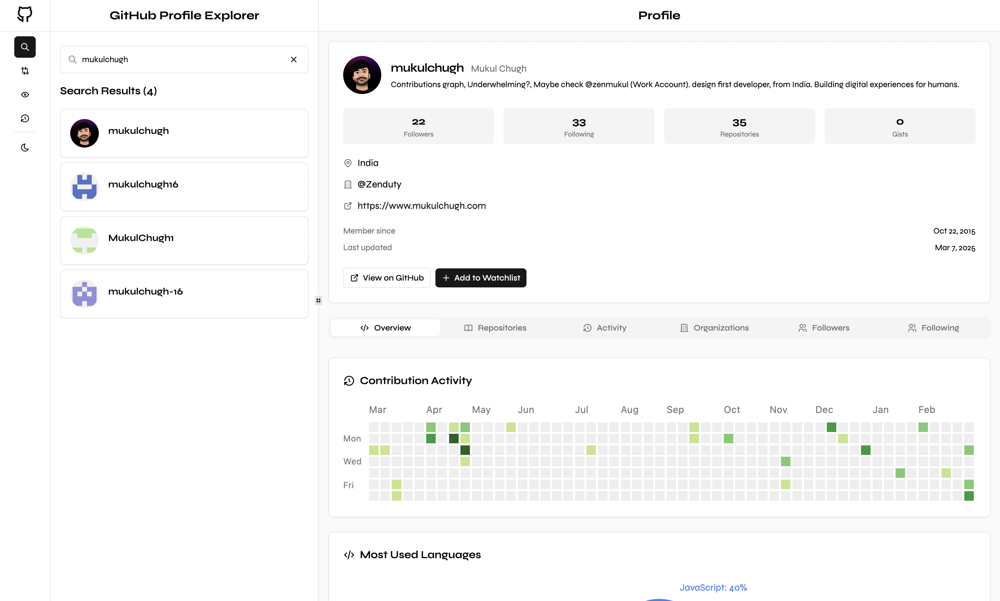

# GitBook - GitHub User Explorer

GitBook is a modern React application that allows users to search for GitHub profiles, view detailed user information, compare multiple users, and create watchlists of their favorite GitHub users. The application provides a comprehensive interface for exploring GitHub user data while offering a clean and responsive user experience.



## Live Project Demo - https://get-gitbook.vercel.app/

## 🚀 Features

- **User Search**: Search GitHub users by username with real-time suggestions
- **Detailed Profile View**: View comprehensive user information including:
  - Profile details and statistics
  - Repository list with filtering and sorting
  - Activity feed showing recent GitHub events
  - Organization memberships
  - Follower and following lists
- **User Comparison**: Compare multiple GitHub users side by side
- **Watchlist**: Add users to a watchlist for quick access
- **Search History**: Track and revisit previously searched users
- **Responsive Design**: Optimized for both desktop and mobile devices
- **Dark/Light Mode**: Toggle between dark and light themes

## 🛠️ Technologies Used

### Core Technologies

- **React 19**: UI library for building the user interface
- **TypeScript**: Type-safe JavaScript for better development experience
- **Vite**: Fast and efficient build tool

### UI Components & Styling

- **Tailwind CSS**: Utility-first CSS framework for styling
- **Radix UI**: Headless UI components (Avatar, Dialog, DropdownMenu, etc.)
- **Shadcn/UI**: Component library built on top of Tailwind CSS and Radix UI
- **Next Themes**: Theming solution for light/dark mode
- **clsx & tailwind-merge**: Utility libraries for conditional class name management
- **class-variance-authority**: For managing variant styles

### State Management & Data Fetching

- **TanStack React Query**: Data fetching, caching, and state management
- **Browser LocalStorage**: For persistent data (watchlist, search history)

### Routing

- **React Router DOM**: For page navigation and routing

### Visualization

- **Recharts**: Chart library for data visualization

### Other Libraries

- **date-fns**: Date formatting and manipulation
- **react-resizable-panels**: For resizable panel layouts
- **sonner**: Toast notifications
- **@tabler/icons-react**: Icon set

## 📊 Data Flow

The application follows a clear data flow pattern:

1. **User Input**: User enters a search term or selects actions from the UI
2. **Data Fetching**:
   - Custom hooks (`use-github-search`, `use-github-user-details`, etc.) use TanStack Query to fetch data
   - API requests are made to GitHub's REST API via the `api.ts` client
3. **State Management**:
   - React Query manages server state (caching, loading states, etc.)
   - React Context (`ThemeProvider`, `ViewControlProvider`) manages application state
   - Custom hooks handle persistent state via LocalStorage
4. **Rendering**: Components render based on the current state and data
5. **User Interface**: Shadcn/UI and Radix UI components provide the visual interface
6. **Storage**: Important user data is persisted in LocalStorage (watchlist, search history)

## 🔗 API Integration

The application integrates with the GitHub REST API through a custom API client:

### Endpoints Used

- `/search/users`: Search for GitHub users
- `/users/{username}`: Get detailed user information
- `/users/{username}/repos`: Get user repositories
- `/users/{username}/events`: Get user activity
- `/users/{username}/orgs`: Get user organizations
- `/users/{username}/followers`: Get user followers
- `/users/{username}/following`: Get users a user is following

### Rate Limiting

The GitHub API has rate limits (60 requests per hour for unauthenticated requests). The application handles rate limiting by:

- Implementing debouncing on search inputs
- Caching results with React Query
- Displaying appropriate error messages when rate limits are reached

## 💻 Project Structure

```
src/
├── assets/         # Static assets like images and icons
├── components/
│   ├── ui/         # UI components (buttons, cards, etc.)
│   └── ...         # Feature-specific components
├── contexts/       # React contexts for state management
├── hooks/          # Custom React hooks
├── lib/            # Utility libraries
│   ├── api.ts      # GitHub API client
│   ├── constants.ts # Application constants
│   ├── query-client.ts # React Query configuration
│   ├── storage.ts  # LocalStorage utilities
│   └── utils.ts    # General utility functions
├── pages/          # Page components
│   ├── home-page.tsx    # Main application page
│   └── not-found.tsx # 404 page
├── app.tsx         # Root application component
├── main.tsx        # Application entry point
└── index.css       # Global styles
```

## 🧩 Key Components

- **Home**: Main page component that orchestrates the app layout
- **SearchSection**: Handles user search functionality
- **ProfileDetails**: Displays comprehensive user information
- **CompareSection**: Allows comparing multiple GitHub users
- **WatchlistSection**: Manages users added to watchlist
- **HistorySection**: Shows search history and allows revisiting previous searches
- **Navigation**: Provides navigation between different sections
- **UserProfileCard**: Card component for displaying user information

## 🚀 Getting Started

1. Clone the repository
2. Install dependencies:
   ```
   pnpm install
   ```
3. Start the development server:
   ```
   pnpm dev
   ```
4. Build for production:
   ```
   pnpm build
   ```

## 📦 Scripts

- `pnpm dev`: Start development server
- `pnpm build`: Build for production
- `pnpm lint`: Run ESLint
- `pnpm preview`: Preview production build
- `pnpm format`: Format code with Prettier
- `pnpm format:check`: Check formatting
- `pnpm lint:fix`: Fix linting issues
- `pnpm cache:clean`: Clean package manager cache
- `pnpm clean`: Clean build artifacts
- `pnpm prebuild`: Run checks before building

## 🌐 Browser Support

The application is built with modern web standards and should work on all modern browsers.
